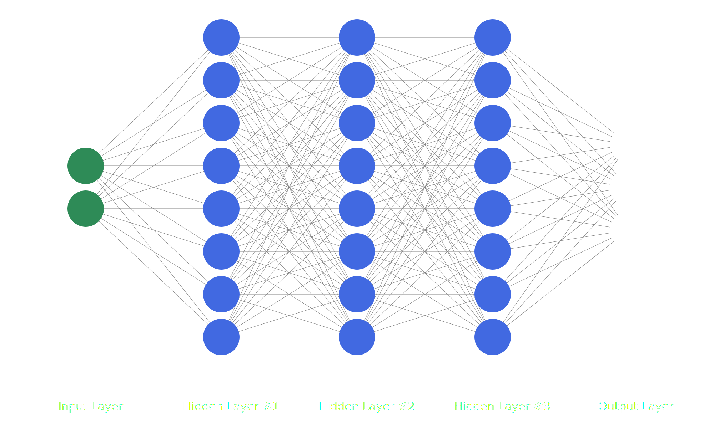

# Neural Networks SVG Generator

## What it looks like

With command: `python main.py -f "test" -r "2000x1200" -nodes "2 8 3" -hidden "3" -colors "seagreen black royalblue gray"`



## Commands
### Running the program
``` bash
python main.py -f "test" -r "2000x1200" -nodes "2 8 3" -hidden "3" -colors "seagreen black royalblue gray"
```

### Starting flask (accessible by host computer only)
``` bash
flask --app NN_SVG_Generator/main run
```

### Starting flask (accessible by all users on network)
``` bash
flask --app NN_SVG_Generator/main run --host=0.0.0.0
```

### Listing available routes
``` bash
flask --app main routes
```

### List all python processes
``` bash
ps -fA | grep python
``` 

### Kill process
Use the 2nd listed number on the line
``` bash
kill XXXXX
```

## References
- [Flask Documentation](https://flask.palletsprojects.com/en/2.3.x/quickstart/)
